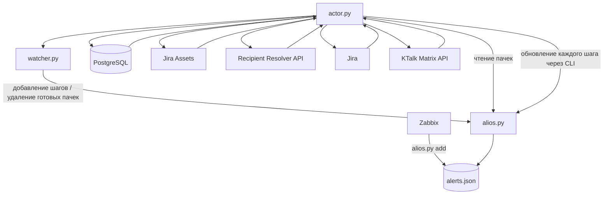

# alerter_v2

Сервис автоматической обработки событий Zabbix с хранением промежуточного состояния в JSON, получением данных услуги из Jira Assets, созданием инцидента Jira и отправкой уведомлений в KTalk.

Проект построен как набор простых модулей, объединённых общим файлом состояния. Каждый шаг фиксирует результат выполнения в `/tmp/alerts.json`, поэтому незавершённые или ошибочные операции повторяются при следующих запусках actor.

## Назначение

`alerter_v2` выполняет следующий процесс:

1. Принимает событие Zabbix через CLI `alios.py`.
2. Выделяет короткие имена услуг из групп, начинающихся с `SG/`.
3. Создаёт или обновляет пачки событий в JSON-файле состояния.
4. Получает Insight ID услуги из PostgreSQL.
5. Загружает данные услуги и ответственных пользователей из Jira Assets.
6. Преобразует AD-логины получателей в KTalk mention ID через resolver API.
7. Создаёт инцидент Jira.
8. Отправляет корневое сообщение в KTalk, приглашает и упоминает получателей.
9. Отправляет агрегированные сообщения при изменении количества активных событий.
10. Удаляет полностью обработанные и восстановленные пачки после заданной задержки.

## Общая схема



## Архитектура проекта

| Файл | Назначение |
|---|---|
| `alios.py` | Единственная CLI-точка изменения и чтения JSON-файла состояния. Создаёт пачки, изменяет баланс, добавляет шаги, выполняет выборку и удаление. |
| `watcher.py` | Перед обработкой добавляет обязательные шаги и проверяет возможность удаления завершённых пачек. |
| `actor.py` | Оркестратор. Запускает watcher, читает состояние, последовательно выполняет шаги и сохраняет их результат через `alios.py`. |
| `db.py` | Получает Insight ID по короткому имени услуги из PostgreSQL. |
| `insight.py` | Загружает данные услуги, статус, тип инцидента, функцию и список получателей из Jira Assets. |
| `mktapi.py` | Получает KTalk mention ID по AD-логинам через recipient resolver API. |
| `jira_inc.py` | Создаёт инцидент Jira. |
| `ktalk_message.py` | Отправляет корневые и агрегированные сообщения, создаёт тред, приглашает и упоминает пользователей. |
| `config/config_check.py` | Проверяет наличие обязательных настроек перед запуском actor. |
| `config/secret_masking.py` | Маскирует секреты в сообщениях об ошибках и логах. |
| `config/local_settings_and_secrets.py.example` | Шаблон локальной конфигурации. |

## Требования

Проект предназначен для Linux, так как использует:

- `fcntl` для файловых блокировок;
- `SIGALRM` для ограничения времени работы actor;
- файловое состояние и логи в `/tmp`.

Необходимы:

- Python 3;
- PostgreSQL-клиент для Python;
- библиотека `requests`;
- сетевой доступ к PostgreSQL, Jira Assets, Jira, resolver API и KTalk.

Установка Python-зависимостей:

```bash
python3 -m pip install requests psycopg2-binary
```

В окружениях, где используется системная сборка `psycopg2`, установите пакет способом, принятым в вашей ОС.

## Конфигурация

Создайте рабочий файл настроек из шаблона:

```bash
cp config/local_settings_and_secrets.py.example \
   config/local_settings_and_secrets.py
```

Заполните параметры в `config/local_settings_and_secrets.py`.

Основные группы настроек:

- PostgreSQL: подключение к таблице соответствия короткого имени и Insight ID;
- Jira Assets: URL, токен и идентификаторы атрибутов;
- Jira: проект, тип задачи, приоритет и custom fields;
- resolver API: URL, таймаут и необязательный bearer token;
- KTalk: Matrix API, room ID, bearer token, retry и timeout-параметры;
- actor/watcher: блокировки, таймауты и ограничения размера логов;
- агрегированные сообщения: количество повторов и интервал между ними.

Файл `config/local_settings_and_secrets.py` добавлен в `.gitignore`. Не сохраняйте реальные токены и пароли в Git.

Перед выполнением шагов `actor.py` вызывает `ValidateConfig()`. При отсутствии обязательного параметра обработка завершается с ошибкой конфигурации.

## Запись событий из Zabbix

### Активное событие

```bash
python3 alios.py add \
  --event 1 \
  --groups "AVAIL, SG/S.AXR, TMP" \
  --triggerTime "2026.07.03 12:00:00" \
  --trigName "Недоступность сервиса" \
  --message "Дополнительные данные события" \
  --severity 4 \
  --eventid 123456 \
  -v
```

### Восстановление события

```bash
python3 alios.py add \
  --event 0 \
  --groups "AVAIL, SG/S.AXR, TMP" \
  --triggerTime "2026.07.03 12:30:00" \
  --eventRecoveryTime "2026.07.03 12:30:00" \
  --trigName "Недоступность сервиса" \
  --message "Событие восстановлено" \
  --severity 4 \
  --eventid 123456 \
  -v
```

Корневые ключи извлекаются из всех групп, начинающихся с `SG/`.

Примеры:

| Исходная группа | Корневой ключ |
|---|---|
| `SG/S.AXR` | `S.AXR` |
| `SG/S.prodss/sd` | `S.prodss` |

Если в аргументе `--groups` найдено несколько подходящих групп, одно событие обновит несколько независимых пачек.

Для severity `5` параметр `--eventid` обязателен. Он используется как ключ записи в `criticalEvent` и позволяет отдельно закрывать каждое критическое событие.

## Запуск обработчика

Ручной запуск:

```bash
python3 actor.py -v
```

При необходимости можно указать собственные пути:

```bash
python3 actor.py \
  --cli-path /opt/alerter_v2/alios.py \
  --watcher-path /opt/alerter_v2/watcher.py \
  --state-file /tmp/alerts.json \
  -v
```

Actor рассчитан на периодический запуск, например через cron или systemd timer.

Пример cron-записи для запуска раз в минуту:

```cron
* * * * * cd /opt/alerter_v2 && /usr/bin/python3 actor.py
```

Параллельные экземпляры actor защищены эксклюзивной блокировкой. Если блокировка не получена за настроенный таймаут, новый экземпляр завершится без обработки. Максимальное время одного запуска actor также ограничено настройкой.

## Последовательность обработки actor

Каждый запуск выполняет следующие действия:

1. Захватывает блокировку actor.
2. Проверяет конфигурацию.
3. Запускает `watcher.py` отдельным процессом.
4. Watcher добавляет недостающие обязательные шаги.
5. Watcher пытается удалить готовые пачки через `alios.py del-ready`.
6. Actor загружает актуальное состояние через `alios.py select`.
7. Для каждой пачки выполняет шаги по возрастанию их числового ключа.
8. После каждого шага записывает полный результат обратно через `alios.py update`.
9. Освобождает блокировку actor.

Actor не изменяет `/tmp/alerts.json` напрямую.

## Формирование набора шагов

Сначала для каждой новой пачки добавляются базовые шаги:

1. `resolveInsightId`;
2. `loadInsightData`.

Остальные шаги добавляются только после успешной загрузки данных услуги и только если услуга имеет статус `Актуально`.

| Severity | Дополнительные шаги |
|---|---|
| `0` | Дополнительные действия не выполняются. |
| `1–4` | Разрешение KTalk-пользователей, создание low-severity инцидента Jira, корневое и агрегированное сообщение KTalk. |
| `5` | Разрешение KTalk-пользователей, создание critical-инцидента Jira, критическое корневое и агрегированное сообщение KTalk. |

Low-severity и critical-шаги разделены намеренно, хотя часть текущей реализации использует общие функции. Это позволяет независимо менять поведение сценариев в дальнейшем.

## Состояния шагов

В JSON используется фактическое имя поля `stepSate`.

| Значение | Состояние |
|---:|---|
| `0` | Шаг ожидает выполнения или продолжения. |
| `1` | Шаг успешно завершён. |
| `2` | Выполнение завершилось ошибкой. |

`retryNumber` увеличивается при ошибках. Шаги со значением `stepSate`, отличным от `1`, снова рассматриваются при следующем запуске actor.

Обязательные шаги останавливают обработку текущей пачки при ошибке. Остальные пачки продолжают обрабатываться независимо.

Не переименовывайте поля `stepSate` и `zeroRecaveryBalance` во внешних интеграциях: это текущие имена полей формата состояния.

## Пример состояния

Сокращённый пример одной пачки:

```json
[
  {
    "S.AXR": {
      "event": "1",
      "groups": "AVAIL, SG/S.AXR, TMP",
      "triggerTime": "2026.07.03 12:00:00",
      "trigName": "Недоступность сервиса",
      "message": "Дополнительные данные события",
      "severity": "4",
      "eventBalance": 1,
      "criticalEvent": {},
      "zeroRecaveryBalance": "",
      "action": {
        "1": {
          "stepName": "resolveInsightId",
          "moduleName": "InsightID",
          "stepSate": 1,
          "errorMessage": "",
          "retryNumber": 0,
          "insightId": "TZ-121"
        },
        "2": {
          "stepName": "loadInsightData",
          "moduleName": "InsightData",
          "stepSate": 0,
          "errorMessage": "",
          "retryNumber": 0,
          "isActiv": 0,
          "recipientADUserList": []
        }
      }
    }
  }
]
```

Корневой элемент всегда является списком. Каждый элемент списка должен быть словарём ровно с одним корневым ключом.

## Баланс событий

`eventBalance` отражает количество активных событий внутри пачки:

- `event=1` увеличивает баланс;
- `event=0` уменьшает баланс, но не ниже нуля;
- при достижении нуля заполняется `zeroRecaveryBalance`;
- новое активное событие очищает `zeroRecaveryBalance`.

Для severity `5` дополнительно ведётся словарь `criticalEvent`:

```json
"criticalEvent": {
  "123456": {
    "startTime": "2026.07.03 12:00:00",
    "endTime": ""
  },
  "123457": {
    "startTime": "2026.07.03 12:05:00",
    "endTime": "2026.07.03 12:15:00"
  }
}
```

Пустой `endTime` означает, что критическое событие остаётся активным.

## Агрегированные сообщения

После создания корневого сообщения отдельный шаг отслеживает изменение `eventBalance`.

При изменении баланса:

1. агрегированный шаг сбрасывается в состояние ожидания;
2. сохраняется целевой баланс;
3. сообщение отправляется в существующий тред;
4. отправка повторяется настроенное количество раз;
5. между попытками выдерживается настроенный интервал;
6. после достижения лимита шаг получает `stepSate = 1`.

В шаге сохраняются ID последнего сообщения, время доставки, число повторов и число успешных доставок.

## Защита от дублирования сообщений KTalk

Для каждого сообщения формируется стабильный набор атрибутов и детерминированный Matrix transaction ID.

Перед отправкой модуль ищет уже существующее сообщение с теми же атрибутами. Если KTalk вернул неоднозначный результат, например HTTP `5xx` или произошёл timeout, модуль выполняет дополнительные поисковые запросы и пытается подтвердить фактическую доставку.

Это снижает риск задвоения сообщений при ситуации, когда KTalk вернул ошибку, но сообщение уже появилось в комнате.

## Условия удаления пачки

Watcher удаляет пачку только через команду `alios.py del-ready` и только при одновременном выполнении всех условий:

- все шаги имеют `stepSate = 1`;
- `eventBalance = 0`;
- в `criticalEvent` нет записей с пустым `endTime`;
- `zeroRecaveryBalance` заполнен;
- с момента обнуления баланса прошла требуемая задержка.

Текущие задержки:

| Условие | Задержка |
|---|---:|
| Обычное время | 30 минут |
| С 21:00 включительно до 09:00 исключительно | 180 минут |
| Суббота или воскресенье | 180 минут |

Если одновременно подходят несколько правил, применяется максимальная задержка.

## Команды `alios.py`

### Просмотр всего состояния

```bash
python3 alios.py select --path '$'
```

### Просмотр конкретной пачки

```bash
python3 alios.py select --path '$.S.AXR'
```

CLI поддерживает корневые ключи, содержащие точки: при разборе пути выбирается наиболее длинное совпадение с существующим корневым ключом.

### Обновление значения

```bash
python3 alios.py update \
  --path '$.S.AXR.action.1' \
  --json-data '{"stepName":"resolveInsightId","moduleName":"InsightID","stepSate":1,"errorMessage":"","retryNumber":0,"insightId":"TZ-121"}'
```

### Добавление обязательных действий

```bash
python3 alios.py update \
  --path '$.S.AXR' \
  --required-actions
```

### Удаление по ключу без проверки готовности

```bash
python3 alios.py del --key 'S.AXR'
```

### Безопасное удаление готовой пачки

```bash
python3 alios.py del-ready --key 'S.AXR'
```

Все команды поддерживают альтернативный файл состояния:

```bash
python3 alios.py select \
  --state-file /tmp/alerts-test.json \
  --path '$'
```

## Файл состояния и блокировки

По умолчанию состояние хранится в:

```text
/tmp/alerts.json
```

`alios.py` захватывает эксклюзивную блокировку файла на время чтения и записи. Actor и watcher обращаются к состоянию только через CLI.

Если JSON полностью повреждён и не может быть разобран, исходный файл перемещается в:

```text
/tmp/alerts.json.back
```

После этого создаётся новый пустой файл состояния. Ошибки структуры внутри корректного JSON не исправляются автоматически и требуют проверки.

## Логи

Основные файлы:

| Файл | Содержимое |
|---|---|
| `/tmp/alios.log` | Изменения состояния, аргументы CLI, блокировки и ошибки структуры. |
| `/tmp/actor.log` | Запуск watcher, выполнение модулей, результаты шагов и итоговые счётчики. |

Флаг `-v` дополнительно выводит сообщения в stdout.

Размер логов ограничивается параметрами `LOG_MAX_SIZE_BYTES` и `LOG_KEEP_SIZE_BYTES`. Чувствительные значения маскируются перед записью.

## Диагностика

### Actor сообщает об ошибке конфигурации

Проверьте наличие файла:

```text
config/local_settings_and_secrets.py
```

Затем заполните все параметры, перечисленные в сообщении `Configuration validation failed`.

### Пачка не получает интеграционные шаги

Проверьте шаг `loadInsightData`:

- `stepSate` должен быть равен `1`;
- `isActiv` должен быть равен `1`;
- услуга в Jira Assets должна иметь статус `Актуально`.

### Шаг постоянно повторяется

Проверьте:

- `errorMessage` шага;
- `retryNumber`;
- доступность внешнего сервиса;
- соответствующий фрагмент `/tmp/actor.log`;
- корректность данных предыдущего шага.

### Пачка не удаляется

Выполните:

```bash
python3 alios.py del-ready --key 'S.AXR'
```

Команда вернёт JSON с причиной, по которой удаление пока невозможно.

### Сообщение KTalk появилось, но шаг завершился ошибкой

Проверьте параметры поиска подтверждения сообщения:

- `KTALK_MESSAGE_SEARCH_LIMIT`;
- `KTALK_MESSAGE_SEARCH_ATTEMPTS`;
- `KTALK_MESSAGE_SEARCH_DELAY_SECONDS`;
- права bearer-пользователя на чтение истории комнаты.

## Принципы отказоустойчивости

- Состояние каждого шага сохраняется отдельно.
- Завершённые шаги не выполняются повторно.
- Ошибка одной пачки не останавливает обработку остальных пачек.
- Actor имеет общий таймаут выполнения.
- Параллельные actor-процессы защищены блокировкой.
- Внешние HTTP-запросы имеют таймауты.
- Неоднозначная отправка KTalk подтверждается поиском фактически созданного события.
- Удаление выполняется только после проверки состояния, баланса, критических событий и возраста пачки.
- Реальные секреты хранятся только в локальном конфигурационном файле.
